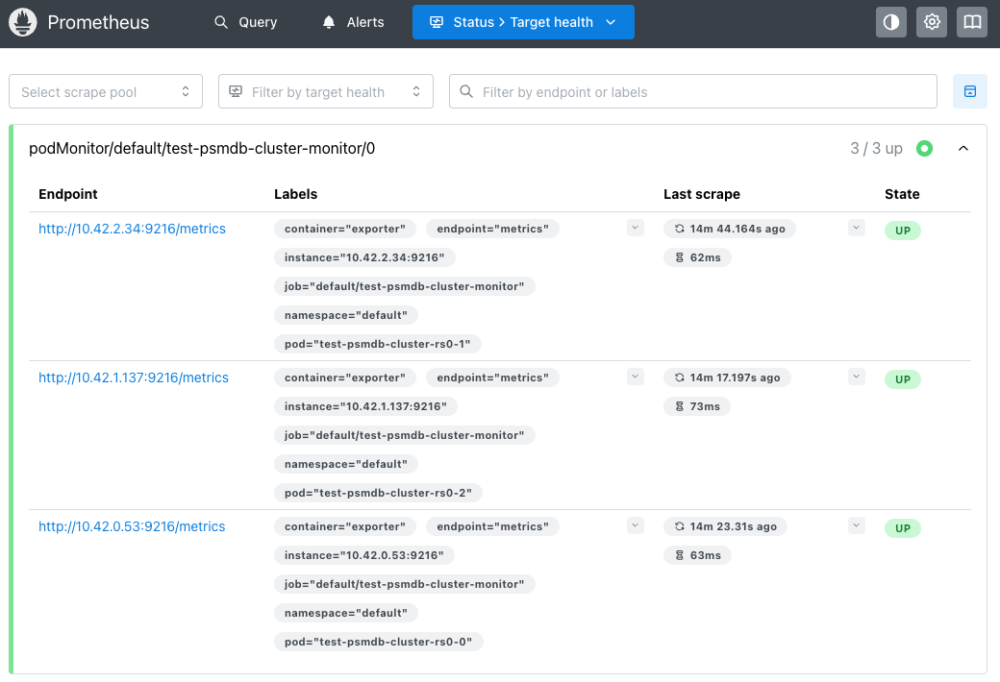

# How to integrate with Prometheus operator

1. Install Prometheus. 

Create namespace to use for prometheus.

```bash
kubectl create namespace prometheus
```

Below uses `prometheus-community/kube-prometheus-stack`, it installs CRDs, prometheus-operator and creates `Prometheus` instance which selects all `PodMonitor` by assigning empty value.

```bash
helm install prometheus prometheus-community/kube-prometheus-stack --namespace prometheus --set-json prometheus.prometheusSpec.podMonitorSelector={} --set prometheus.prometheusSpec.podMonitorSelectorNilUsesHelmValues=false
```

Forward the Prometheus port.

```bash
kubectl port-forward -n prometheus svc/prometheus-kube-prometheus-prometheus 9090:9090
```

You can check Prometheus web UI on localhost:9090.

2. Add new component types and names in `definition/provider.yaml`, `definition/versions.yaml` and `internal/common/spec.go`. Then generate provider spec with `make generate` 

3. Implement metrics exporter to export metrics in PSMDB provider. For Percona Server MongoDB provider, `mongodb_exporter` sidecar is used to extract metrics.

4. Implement Prometheus `PodMonitor` to fetch exported metrics.

5. Start the provider and create an Instance.

```bash
kubectl apply -f - <<EOF
apiVersion: core.openeverest.io/v1alpha1
kind: Instance
metadata:
  name: psmdb-prometheus-test
spec:
  provider: percona-server-mongodb
  components:
    engine:
      type: mongod
      replicas: 3
      resources:
        limits:
          cpu: "1"
          memory: 4G
      storage:
        size: 25Gi
    metricsExporter:
      customSpec:
        enabled: true
EOF
```

6. Check prometheus metrics. It takes a few minutes to scrape and metrics to be available on Prometheus Web UI 9090.



