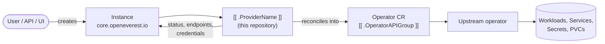

# [[ .ProviderName ]]

<!-- TODO(provider): replace the heading with the product name (e.g. "Percona Server for MongoDB
Provider", "KubeAI Provider"). -->

> [!WARNING]
> **Pre-alpha.** OpenEverest v2 and this provider are under active development. CRD schemas,
> chart values and defaults change frequently, including in breaking ways, and there is no
> supported upgrade path between versions yet. Not for production use.

<!-- TODO(sdk): remove the pre-alpha banner and the status badge at v2 GA. -->

[](https://github.com/openeverest/openeverest)
[](https://[[ .ModulePath ]]/actions/workflows/ci.yaml)
[](https://[[ .ModulePath ]]/releases)
[](https://pkg.go.dev/[[ .ModulePath ]])
[](LICENSE)

<!-- TODO(provider): one sentence — what this runs, and on top of which operator. -->
Run **`<technology>`** on Kubernetes through [OpenEverest](https://github.com/openeverest/openeverest),
backed by the [`<operator>`](https://example.com/operator).

## What this is

OpenEverest providers translate a single, technology-agnostic `Instance` custom resource into
the native custom resources of an upstream Kubernetes operator — for databases, but equally
for caches, message queues, object storage, or model-serving runtimes. This repository is the
provider for `<technology>`: it owns the technology-specific knowledge — topologies, versions,
parameters, backup wiring — so that users, the API server, and the UI stay technology-agnostic.

> [!IMPORTANT]
> **This provider is not standalone.** It requires an OpenEverest installation (core CRDs and
> controller) in the cluster. Installing this chart on its own does nothing.
> See [Install OpenEverest](https://openeverest.io/documentation/current/quick-install.html).



The provider watches `Instance` resources whose `spec.providerRef.name` is
`[[ .ProviderName ]]`, and reports workload health back onto `Instance.status`. It never
manages pods directly — all lifecycle work is delegated to the operator.

## Compatibility

<!-- TODO(provider): keep this table accurate for every release. -->

| [[ .ProviderName ]] | OpenEverest | Operator | Kubernetes |
|---|---|---|---|
| `0.1.x` | `>= 2.0.0` | `x.y.z` | `1.30` – `1.34` |

## Capabilities

<!-- TODO(provider): the rows below are the standard set across all OpenEverest providers.
     Keep the wording of the rows you use identical so providers stay comparable, and delete
     the rows that make no sense for this technology rather than marking them unsupported. -->

What you can do to a running instance through the `Instance` API. Upgrading the
provider itself is covered under [Installation](#installation).

| Capability | Status | Notes |
|---|---|---|
| Provisioning | ❌ | |
| Horizontal scaling | ❌ | |
| Vertical scaling (CPU / memory) | ❌ | |
| Version upgrades | ❌ | |
| Custom configuration | ❌ | |
| Monitoring | ❌ | |
| TLS | ❌ | |

Stateful workloads additionally report:

| Capability | Status | Notes |
|---|---|---|
| Persistent storage | ❌ | |
| Storage expansion | ❌ | |
| Backups (on demand) | ❌ | |
| Backups (scheduled) | ❌ | |
| Point-in-time recovery | ❌ | |
| Restore | ❌ | |

## Installation

<!-- TODO(provider): confirm the published chart coordinates (org/repo) match where you publish. -->

The provider chart is published as an OCI artifact:

```bash
helm install [[ .ProviderName ]] \
  oci://ghcr.io/openeverest/charts/[[ .ProviderName ]] \
  --version <chart-version> \
  --namespace everest-system
```

<!-- TODO(provider): keep whichever of the two bullets below is true, delete the other. -->
- The operator is bundled as a chart dependency and is installed automatically.
- The operator is **not** bundled — install it before installing this provider.

Upgrade and uninstall:

```bash
helm upgrade [[ .ProviderName ]] oci://ghcr.io/openeverest/charts/[[ .ProviderName ]]
helm uninstall [[ .ProviderName ]] --namespace everest-system
```

Uninstalling the chart does **not** delete running `Instance` resources or their data.

## Usage

Verify that the provider registered itself:

```bash
kubectl get providers.core.openeverest.io [[ .ProviderName ]]
```

Create an instance:

```yaml
apiVersion: core.openeverest.io/v1alpha1
kind: Instance
metadata:
  name: my-instance
spec:
  providerRef:
    name: [[ .ProviderName ]]
  components:
    engine:
      type: [[ .ComponentType ]]
      replicas: 3
      resources:
        requests:
          cpu: 500m
          memory: 2G
      storage:
        size: 10Gi
```

Component names are defined by this provider — see [definition/provider.yaml](definition/provider.yaml).
`spec.version` and `spec.topology` are optional; the provider defaults apply.
More examples live in [examples/](examples/).

Watch it come up and read the connection details:

```bash
kubectl get instance my-instance -w
kubectl get instance my-instance -o jsonpath='{.status.connection}'
```

Credentials, when the technology has any, are in the secret named by
`.status.connection.credentialsSecretRef`.

## Topologies

<!-- TODO(sdk): these blocks are hand-maintained until `provider-sdk generate` fills them
     from definition/. Until then, update them whenever definition/ changes. -->

<!-- BEGIN GENERATED: topologies -->
| Topology | Default | Description |
|---|---|---|
| `[[ .TopologyName ]]` | ✅ | |
<!-- END GENERATED: topologies -->

## Versions

<!-- BEGIN GENERATED: versions -->
| Version bundle | Default | [[ .ComponentType ]] |
|---|---|---|
| | | |
<!-- END GENERATED: versions -->

Source of truth: [definition/versions.yaml](definition/versions.yaml).

<!-- TODO(provider): document the supported upgrade paths (minor only? operator first?). -->

## Configuration

- **Chart values:** [charts/[[ .ProviderName ]]/values.yaml](charts/[[ .ProviderName ]]/values.yaml)
- **Instance parameters:** per-component and per-topology `parameters` schemas, defined under
  [definition/](definition/) and published on the `Provider` resource
  (`kubectl get provider [[ .ProviderName ]] -o yaml`). The API server and the UI validate
  user input against these schemas.

<!-- TODO(provider): call out the technology-specific knobs worth knowing about. -->

## Development

Requires Go (see [go.mod](go.mod)), Docker, Helm, kubectl, and a Kubernetes cluster you can
reach. [dev/README.md](dev/README.md) covers the environment end to end: the recommended
local k3d setup, running against a cluster you already have, and every `dev/.env` setting.

```bash
make dev-up             # local cluster + Tilt dev environment (see dev/README.md)
make generate           # RBAC, provider spec, Helm chart sync
make run                # run the provider locally against the cluster
make test-unit
make test-integration   # chainsaw suites under test/integration/
make dev-down
```

`make help` lists every target. `make verify` fails when generated files are stale — run
`make generate` and commit the result.

The provider contract (`Validate` / `Sync` / `Status` / `Cleanup`), RBAC markers, watches,
code generation, and the backup/restore interfaces are documented once for all providers in
[PROVIDER_DEVELOPMENT.md](https://github.com/openeverest/provider-sdk/blob/main/PROVIDER_DEVELOPMENT.md).

### Layout

| Path | Purpose |
|---|---|
| `cmd/provider/` | Entry point |
| `internal/provider/` | `ProviderInterface` implementation, backup interfaces, RBAC markers |
| `internal/common/` | Component name constants |
| `definition/` | Provider identity, component types, versions, topologies, backup classes |
| `charts/[[ .ProviderName ]]/` | Helm chart (`generated/` is produced by `make generate`) |
| `config/rbac/role.yaml` | Generated `ClusterRole` — do not edit |
| `test/integration/` | Chainsaw suites (see its `README.md`) |
| `test/vars.sh` | Pinned operator and workload versions used by tests |
| `examples/` | Example `Instance` resources |
| `dev/` | Tilt dev environment, `.env` configuration, k3d cluster config |
| `.github/workflows/` | CI: lint, build, unit and integration tests, release |

### Testing

- **Unit tests** — `make test-unit`.
- **Integration tests** — chainsaw suites under `test/integration/`. The scaffolded `core/`
  suite is a skeleton: it verifies the provider deployment and includes commented-out
  lifecycle steps to enable as you implement the provider. See
  [test/integration/README.md](test/integration/README.md).
- **CI** — `.github/workflows/ci.yaml` runs lint, build, unit tests, generated-file
  verification, Helm lint, and each integration suite on every pull request.

## Troubleshooting

```bash
kubectl logs -n everest-system deploy/[[ .ProviderName ]] -f
```

| Symptom | Where to look |
|---|---|
| `Instance` stuck in `Creating` | `kubectl describe instance <name>` conditions, then the provider logs |
| No `Provider` resource in the cluster | Is the chart installed? Check the provider deployment logs |
| `Instance` ignored entirely | `spec.providerRef.name` must be `[[ .ProviderName ]]` |
| Operator resource created but no pods | Inspect the operator's custom resource status — the failure is upstream |

<!-- TODO(provider): add technology-specific gotchas (sysctl limits, storage class or GPU
     requirements, node selectors, …). -->

## Contributing

Issues and pull requests are welcome. See
[PROVIDER_DEVELOPMENT.md](https://github.com/openeverest/provider-sdk/blob/main/PROVIDER_DEVELOPMENT.md)
and the [OpenEverest Code of Conduct](https://github.com/openeverest/openeverest/blob/main/CODE_OF_CONDUCT.md).

## Security

Report vulnerabilities per the
[OpenEverest security policy](https://github.com/openeverest/openeverest/blob/main/SECURITY.md).
Please do not open public issues for security reports.

## License

Apache License 2.0 — see [LICENSE](LICENSE) for details.
